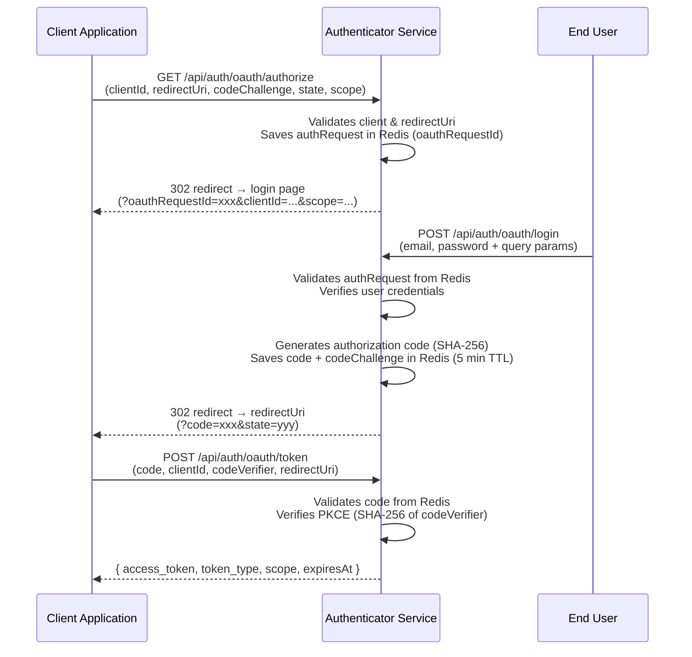
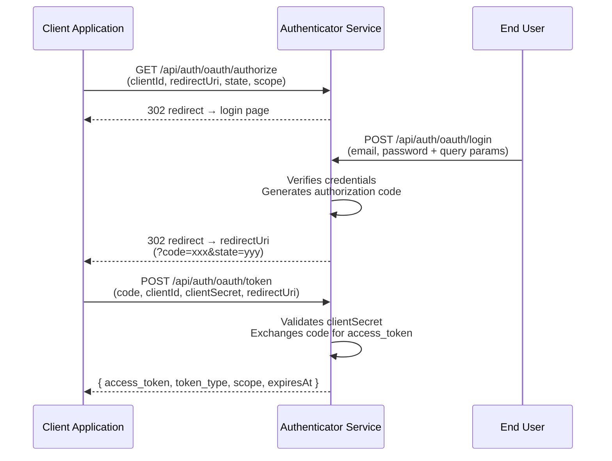
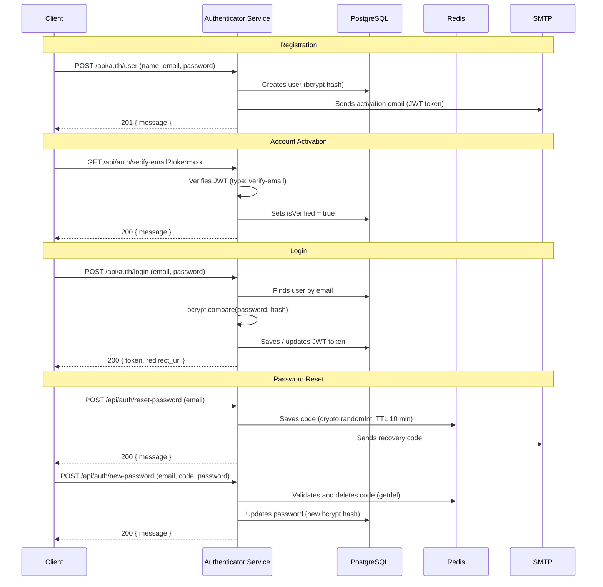

# Authenticator Service

<p align="right">
  <a href="./README.pt-BR.md">🇧🇷 Português</a>
</p>


A NestJS-based authentication and authorization service implementing secure login, email verification, password reset, and a full **OAuth2** flow with Authorization Code and PKCE support.

---

## Table of Contents

- [Features](#features)
- [Tech Stack](#tech-stack)
- [OAuth2 Flow](#oauth2-flow)
- [Authentication Flow](#authentication-flow)
- [Endpoints](#endpoints)
- [Getting Started](#getting-started)
- [Environment Variables](#environment-variables)
- [Tests](#tests)
- [Project Structure](#project-structure)
- [CI/CD](#cicd)

---

## Features

- **User Authentication** — Login, registration and email verification with JWT
- **Password Management** — Reset and update via email code generated with `crypto.randomInt`
- **OAuth2** — Full Authorization Code flow with PKCE (`S256`) support for public clients
- **Client Management** — Register and manage OAuth2 applications (confidential and public clients)
- **Email Notifications** — Dynamic templates with Nodemailer + Handlebars for account activation and password reset
- **Rate Limiting** — Brute-force protection on sensitive endpoints via `@nestjs/throttler`
- **Health Check** — PostgreSQL and Redis connectivity check via `@nestjs/terminus`
- **Structured Logging** — Custom logger with per-method context, built on top of NestJS `ConsoleLogger`
- **API Documentation** — Interactive Swagger at `/api/docs`

---

## Tech Stack

| Layer            | Technology                   |
| ---------------- | ---------------------------- |
| Framework        | NestJS 11                    |
| Language         | TypeScript 5.9               |
| Database         | PostgreSQL (TypeORM)         |
| Cache / Sessions | Redis (ioredis)              |
| Authentication   | JWT (`@nestjs/jwt`) + Bcrypt |
| Validation       | class-validator + Joi        |
| Email            | Nodemailer + Handlebars      |
| Documentation    | Swagger / OpenAPI            |
| Testing          | Jest 30                      |
| Package manager  | pnpm 10                      |

---

## OAuth2 Flow

### Authorization Code + PKCE (public clients)



### Authorization Code (confidential clients)



---

## Authentication Flow



---

## Endpoints

All endpoints are prefixed with `/api/auth`.

### Authentication — `/api/auth`

| Method | Route                     | Description                       | Rate Limit |
| ------ | ------------------------- | --------------------------------- | ---------- |
| `POST` | `/login`                  | User login                        | 4 req/min  |
| `GET`  | `/verify-email?token=`    | Activates account via JWT token   | —          |
| `POST` | `/reset-password`         | Requests password reset by email  | 4 req/min  |
| `POST` | `/new-password`           | Sets new password with Redis code | 4 req/min  |
| `POST` | `/new-token/email-active` | Resends activation email          | 4 req/min  |

### User — `/api/auth/user`

| Method | Route | Description          |
| ------ | ----- | -------------------- |
| `POST` | `/`   | Registers a new user |

### OAuth2 — `/api/auth/oauth`

| Method | Route        | Description                                                           | Rate Limit |
| ------ | ------------ | --------------------------------------------------------------------- | ---------- |
| `GET`  | `/authorize` | Starts OAuth2 flow, returns redirect with `oauthRequestId`            | —          |
| `POST` | `/login`     | OAuth2 login — validates authRequest and generates `code`             | 5 req/min  |
| `POST` | `/token`     | Exchanges `code` for `access_token` (PKCE and clientSecret supported) | 5 req/min  |

### Client — `/api/auth/client`

| Method | Route | Description                        |
| ------ | ----- | ---------------------------------- |
| `POST` | `/`   | Registers a new OAuth2 application |

### Health — `/api/auth/health`

| Method | Route | Description                              |
| ------ | ----- | ---------------------------------------- |
| `GET`  | `/`   | Checks PostgreSQL and Redis connectivity |

---

## Getting Started

### Prerequisites

- Node.js 22+
- Docker and Docker Compose
- pnpm 10+

### Installation

```bash
# 1. Clone the repository
git clone https://github.com/LuisFernando12/Authenticator-back.git
cd Authenticator-back

# 2. Install dependencies
pnpm install

# 3. Set up environment variables
cp .env.template .env
# edit .env with your values
```

### Running

**Development mode** (starts Postgres + Redis via Docker, app in watch mode):

```bash
pnpm start:dev
```

**Infrastructure only** (Postgres + Redis):

```bash
pnpm start:docker
```

**Production mode:**

```bash
pnpm build
pnpm start:prod
```

**Full environment with Docker Compose:**

```bash
docker compose up
```

API available at `http://localhost:3000`.
Swagger docs: `http://localhost:3000/api/docs`.

---

## Environment Variables

Copy `.env.template` to `.env` and fill in your values:

```env
# PostgreSQL
USER_DB=
DB_PASSWORD=
DB_NAME=
DB_PORT=5432

# Service URLs
SERVICE_VERIFY_EMAIL_URL=   # Base URL for email verification links
SERVICE_URL=                # Public URL of this service
SERVICE_RESET_PASSWORD_URL= # URL of the password reset page
REDIRECT_URI=               # Default redirect URI after login

# CORS
CORS_ORIGIN=                # Allowed origin (e.g. http://localhost:4000)

# OAuth2
OAUTH_LOGIN_URL=            # URL of the frontend OAuth2 login page

# Redis
REDIS_URI=                  # Full URI (e.g. redis://:password@localhost:6379)

# SMTP
SMTP_PORT=
SERVER_SMTP=                # SMTP server hostname (e.g. smtp.example.com)
SERVER_SMTP_USER_NAME=
SERVER_SMTP_PASSWORD=

# JWT
SECRET=                     # Secret key for signing JWT tokens
```

---

## Tests

```bash
# Unit tests
pnpm test

# With coverage
pnpm test:cov

# Watch mode
pnpm test:watch

# E2E
pnpm test:e2e
```

Unit tests cover all services with isolated mocks. The adopted pattern is `expect(fn()).rejects.toThrow()` for error scenarios, ensuring every case is actually exercised.

---

## Project Structure

```
src/
├── config/
│   ├── errors/
│   │   └── oauth.error.ts          # Typed OAuth2 errors (RFC 6749)
│   └── logger/
│       ├── auth-logger.config.ts   # Logger with log/error/warn/debug methods
│       └── base-logger.ts          # Extends NestJS ConsoleLogger
├── controller/                     # HTTP layer
│   ├── auth.controller.ts
│   ├── client.controller.ts
│   ├── health.controller.ts
│   ├── oauth.controller.ts
│   └── user.controller.ts
├── dto/                            # Data Transfer Objects (validation)
├── entity/                         # TypeORM entities
│   ├── client.entity.ts
│   ├── token.entity.ts
│   ├── user-client-consent.entity.ts
│   └── user.entity.ts
├── module/                         # NestJS modules
├── repository/                     # Data access layer
├── service/                        # Business logic
│   ├── auth.service.ts
│   ├── client.service.ts
│   ├── email.service.ts
│   ├── oauth.service.ts
│   ├── redis.service.ts
│   ├── token.service.ts
│   └── user.service.ts
└── templates/                      # Handlebars email templates
    ├── activeAccount.hbs
    └── resetPassword.hbs

test/
└── unit/
    └── service/
        ├── mock/                   # Reusable mocks per service
        └── *.spec.ts               # Unit tests per service
```

---

## CI/CD

The CI pipeline runs automatically on every push and pull request to `main`:

1. **Checkout** the code
2. **Setup pnpm 10** + dependency cache
3. **Setup Node.js 22**
4. **Install** — `pnpm install --frozen-lockfile`
5. **Build** — `pnpm build`
6. **Test** — `pnpm test`
7. **Coverage** — `pnpm test:cov`

---

## License

This project is licensed under the [MIT License](./LICENSE).
