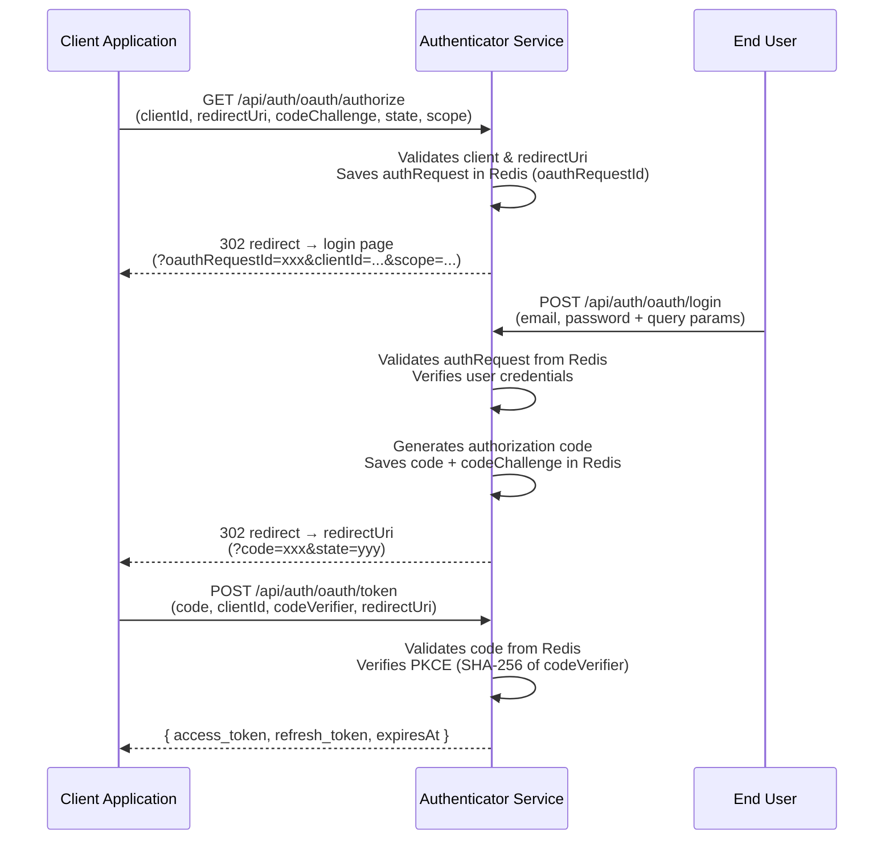
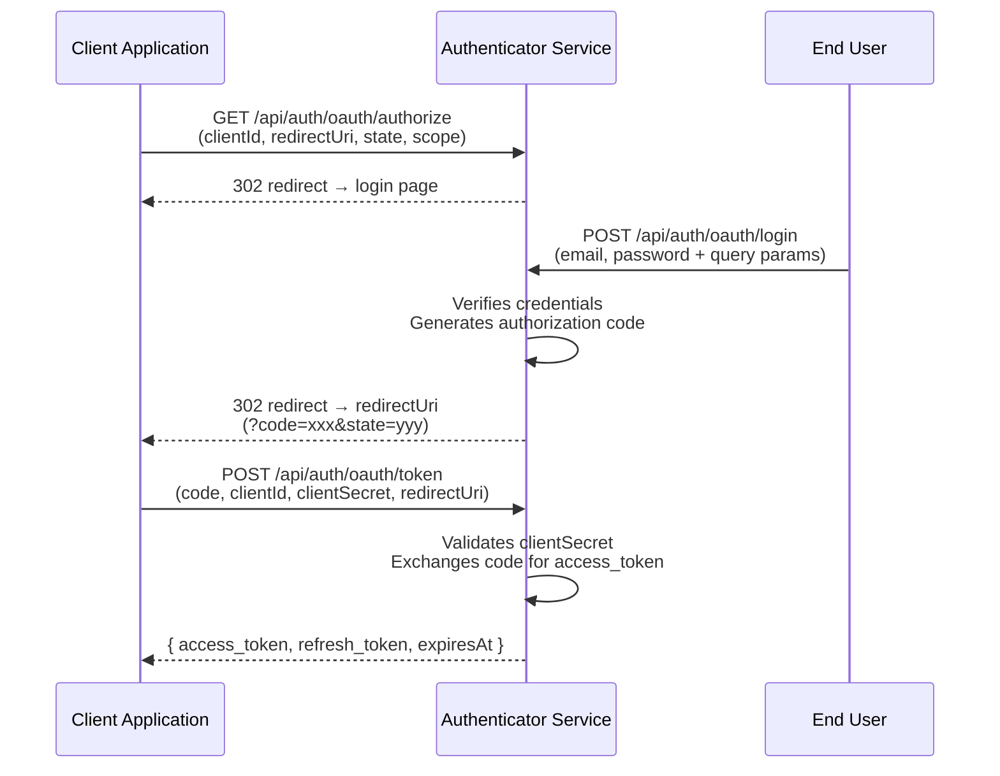
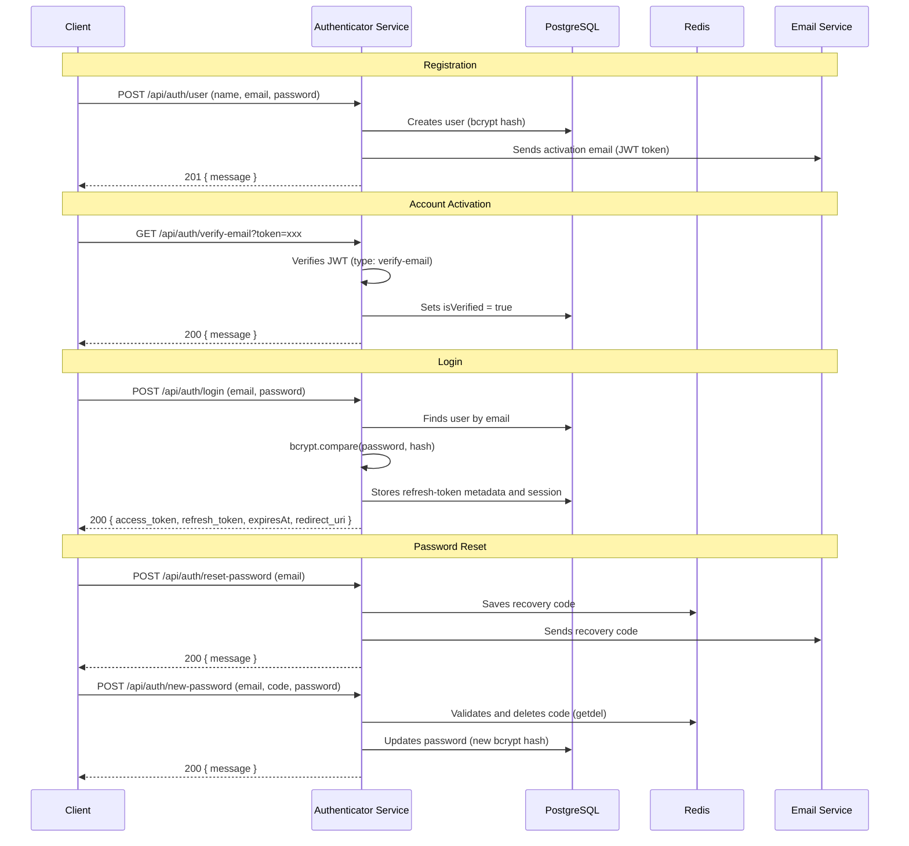

# Authenticator Service

<p align="right">
  <a href="./README.pt-BR.md">🇧🇷 Português</a>
</p>


A NestJS-based authentication and authorization service implementing secure login, email verification, password reset, and a full **OAuth2** flow with Authorization Code and PKCE support.

---

## Table of Contents

- [Features](#features)
- [Tech Stack](#tech-stack)
- [OAuth2 Flow](#oauth2-flow)
- [Authentication Flow](#authentication-flow)
- [Endpoints](#endpoints)
- [Getting Started](#getting-started)
- [Environment Variables](#environment-variables)
- [Tests](#tests)
- [Project Structure](#project-structure)
- [CI/CD](#cicd)

---

## Features

- **User Authentication** — Login, registration and email verification with JWT
- **Password Management** — Reset and update via email code generated with `crypto.randomInt`
- **OAuth2** — Full Authorization Code flow with PKCE (`S256`) support for public clients
- **Client Management** — Register and manage OAuth2 applications (confidential and public clients)
- **Email Notifications** — Dynamic templates with Gmail API, Nodemailer and Handlebars for account activation, account blocking/unblocking and password reset
- **Rate Limiting** — Brute-force protection on sensitive endpoints via `@nestjs/throttler`
- **Health Check** — PostgreSQL and Redis connectivity check via `@nestjs/terminus`
- **Structured Logging** — Custom logger with per-method context, built on top of NestJS `ConsoleLogger`
- **API Documentation** — Interactive Swagger at `/api/docs`

---

## Tech Stack

| Layer            | Technology                   |
| ---------------- | ---------------------------- |
| Framework        | NestJS 11                    |
| Language         | TypeScript 5.9               |
| Database         | PostgreSQL (TypeORM)         |
| Cache / Sessions | Redis (ioredis)              |
| Authentication   | JWT (`@nestjs/jwt`) + Bcrypt |
| Validation       | class-validator + Joi        |
| Email            | Nodemailer + Handlebars      |
| Documentation    | Swagger / OpenAPI            |
| Testing          | Jest 30                      |
| Package manager  | pnpm 10                      |

---

## OAuth2 Flow

### Authorization Code + PKCE (public clients)


```mermaid
sequenceDiagram
    participant App as Client Application
    participant Auth as Authenticator Service
    participant User as End User

    App->>Auth: GET /api/auth/oauth/authorize<br/>(clientId, redirectUri, codeChallenge, state, scope)
    Auth->>Auth: Validates client & redirectUri<br/>Saves authRequest in Redis (oauthRequestId)
    Auth-->>App: 302 redirect → login page<br/>(?oauthRequestId=xxx&clientId=...&scope=...)

    User->>Auth: POST /api/auth/oauth/login<br/>(email, password + query params)
    Auth->>Auth: Validates authRequest from Redis<br/>Verifies user credentials
    Auth->>Auth: Generates authorization code<br/>Saves code + codeChallenge in Redis
    Auth-->>App: 302 redirect → redirectUri<br/>(?code=xxx&state=yyy)

    App->>Auth: POST /api/auth/oauth/token<br/>(code, clientId, codeVerifier, redirectUri)
    Auth->>Auth: Validates code from Redis<br/>Verifies PKCE (SHA-256 of codeVerifier)
    Auth-->>App: { access_token, refresh_token, expiresAt }
```

### Authorization Code (confidential clients)


```mermaid
sequenceDiagram
    participant App as Client Application
    participant Auth as Authenticator Service
    participant User as End User

    App->>Auth: GET /api/auth/oauth/authorize<br/>(clientId, redirectUri, state, scope)
    Auth-->>App: 302 redirect → login page

    User->>Auth: POST /api/auth/oauth/login<br/>(email, password + query params)
    Auth->>Auth: Verifies credentials<br/>Generates authorization code
    Auth-->>App: 302 redirect → redirectUri<br/>(?code=xxx&state=yyy)

    App->>Auth: POST /api/auth/oauth/token<br/>(code, clientId, clientSecret, redirectUri)
    Auth->>Auth: Validates clientSecret<br/>Exchanges code for access_token
    Auth-->>App: { access_token, refresh_token, expiresAt }
```

---

## Authentication Flow


```mermaid
sequenceDiagram
    participant Client
    participant Auth as Authenticator Service
    participant DB as PostgreSQL
    participant Redis
    participant Email as Email Service

    Note over Client,Email: Registration
    Client->>Auth: POST /api/auth/user (name, email, password)
    Auth->>DB: Creates user (bcrypt hash)
    Auth->>Email: Sends activation email (JWT token)
    Auth-->>Client: 201 { message }

    Note over Client,Email: Account Activation
    Client->>Auth: GET /api/auth/verify-email?token=xxx
    Auth->>Auth: Verifies JWT (type: verify-email)
    Auth->>DB: Sets isVerified = true
    Auth-->>Client: 200 { message }

    Note over Client,Email: Login
    Client->>Auth: POST /api/auth/login (email, password)
    Auth->>DB: Finds user by email
    Auth->>Auth: bcrypt.compare(password, hash)
    Auth->>DB: Stores refresh-token metadata and session
    Auth-->>Client: 200 { access_token, refresh_token, expiresAt, redirect_uri }

    Note over Client,Email: Password Reset
    Client->>Auth: POST /api/auth/reset-password (email)
    Auth->>Redis: Saves recovery code
    Auth->>Email: Sends recovery code
    Auth-->>Client: 200 { message }

    Client->>Auth: POST /api/auth/new-password (email, code, password)
    Auth->>Redis: Validates and deletes code (getdel)
    Auth->>DB: Updates password (new bcrypt hash)
    Auth-->>Client: 200 { message }
```

---

## Endpoints

All endpoints are prefixed with `/api/auth`.

### Authentication — `/api/auth`

| Method | Route                     | Description                       | Rate Limit |
| ------ | ------------------------- | --------------------------------- | ---------- |
| `POST` | `/login`                  | User login                        | 5 req/min  |
| `GET`  | `/verify-email?token=`    | Activates account via JWT token   | 5 req/min  |
| `POST` | `/reset-password`         | Requests password reset by email  | 5 req/min  |
| `POST` | `/new-password`           | Sets new password with Redis code | 5 req/min  |
| `POST` | `/new-token/email-active` | Resends activation email          | 5 req/min  |
| `POST` | `/unblock-account`        | Unblocks an account using a code  | 5 req/min  |

### User — `/api/auth/user`

| Method | Route | Description          |
| ------ | ----- | -------------------- |
| `POST` | `/`   | Registers a new user |

### OAuth2 — `/api/auth/oauth`

| Method | Route               | Description                                                                                                 | Rate Limit |
| ------ | ------------------- | ----------------------------------------------------------------------------------------------------------- | ---------- |
| `GET`  | `/authorize`        | Starts OAuth2 flow, returns redirect with `oauthRequestId`                                                  | —          |
| `POST` | `/login`            | OAuth2 login — validates authRequest and generates `code`                                                   | 5 req/min  |
| `POST` | `/token`            | Exchanges `code` for `access_token` (PKCE and clientSecret supported)                                       | 5 req/min  |
| `POST` | `/refresh-token`    | Refreshes `access_token` and `refresh_token` using `grantType` and `refreshToken` in the payload            | 5 req/min  |
| `POST` | `/revoke-token`     | Revokes an access or refresh token passed as the `token` payload field                                      | 5 req/min  |
| `POST` | `/token-introspect` | Introspects an access or refresh token passed as the `token` payload field                                  | 5 req/min  |

### Client — `/api/auth/client`

| Method | Route            | Description                        |
| ------ | ---------------- | ---------------------------------- |
| `POST` | `/`              | Registers a new OAuth2 application |
| `GET`  | `/client-id/:id` | Finds an OAuth2 client by clientId |

### Health — `/api/auth/health`

| Method | Route | Description                              |
| ------ | ----- | ---------------------------------------- |
| `GET`  | `/`   | Checks PostgreSQL and Redis connectivity |

---

## Getting Started

### Prerequisites

- Node.js 22+
- Docker and Docker Compose
- pnpm 10+

### Installation

```bash
# 1. Clone the repository
git clone https://github.com/LuisFernando12/Authenticator-back.git
cd Authenticator-back

# 2. Install dependencies
pnpm install

# 3. Set up environment variables
cp .env.template .env
# edit .env with your values
```

### Running

**Development mode** (starts Postgres + Redis via Docker, app in watch mode):

```bash
pnpm start:dev
```

**Infrastructure only** (Postgres + Redis):

```bash
pnpm start:docker
```

**Production mode:**

```bash
pnpm build
pnpm start:prod
```

**Full environment with Docker Compose:**

```bash
docker compose up
```

API available at `http://localhost:3000`.
Swagger docs: `http://localhost:3000/api/docs`.

---

## Environment Variables

Copy `.env.template` to `.env` and fill in your values:

```env
# PostgreSQL
DB_HOST=
DB_USER=
DB_PASSWORD=
DB_NAME=
DB_PORT=5432

# Service URLs
SERVICE_VERIFY_EMAIL_URL=   # Base URL for email verification links
SERVICE_URL=                # Public URL of this service
SERVICE_RESET_PASSWORD_URL= # URL of the password reset page
SERVICE_UNBLOCK_ACCOUNT_URL= # URL of the account unblock page
REDIRECT_URI=               # Default redirect URI after login

# CORS
CORS_ORIGIN=                # Allowed origin (e.g. http://localhost:4000)
TRUST_PROXY=0               # Optional Express trust proxy setting

# OAuth2
OAUTH_LOGIN_URL=            # URL of the frontend OAuth2 login page

# Redis
REDIS_URI=                  # Full URI (e.g. redis://:password@localhost:6379)

# Gmail API
GMAIL_CLIENT_ID=
GMAIL_CLIENT_SECRET=
GMAIL_REDIRECT_URI=
GMAIL_REFRESH_TOKEN=
GMAIL_SENDER_EMAIL=

# JWT
SECRET=                     # Secret key for signing JWT tokens
CLIENT_SECRET_PEPPER=       # Pepper used when hashing OAuth2 client secrets
ACCESS_TOKEN_EXPIRES_IN=15min
REFRESH_TOKEN_EXPIRES_DAYS=15
EMAIL_VERIFICATION_TOKEN_EXPIRES=6h

# Runtime
NODE_ENV=
PORT=3000
```

---

## Tests

```bash
# Unit tests
pnpm test

# With coverage
pnpm test:cov

# Watch mode
pnpm test:watch

# E2E
pnpm test:e2e
```

Unit tests cover the main use cases with isolated fakes. The adopted pattern is `expect(fn()).rejects.toThrow()` for error scenarios, ensuring every case is actually exercised.

---

## Project Structure

```
src/
├── auth/                           # Authentication domain
│   ├── application/
│   │   ├── port/                   # Application contracts
│   │   └── use-case/               # Login, activation and password flows
│   ├── domain/
│   │   ├── entity/
│   │   ├── enum/
│   │   ├── error/
│   │   └── value-object/
│   └── infrastructure/
│       ├── adapter/
│       ├── controller/
│       ├── dto/
│       └── module/
├── client/                         # OAuth2 client management
│   ├── application/
│   ├── domain/
│   └── infrastructure/
│       ├── adapter/
│       ├── controller/
│       ├── dto/
│       ├── module/
│       ├── persistence/
│       └── repository/
├── config/
│   ├── database/                   # TypeORM data source and migrations
│   ├── decorator/                  # Custom request decorators
│   ├── filters/                    # Global exception filters
│   └── logger/
├── consent/                        # OAuth2 consent domain
│   ├── application/
│   │   ├── port/
│   │   ├── service/
│   │   └── use-case/
│   ├── domain/
│   └── infrastructure/
├── core/                           # Shared app services and modules
│   ├── application/
│   ├── domain/
│   └── infrastructure/
├── email/                          # Email queue, workers, providers and templates
│   ├── application/
│   ├── domain/
│   └── infrastructure/
├── module/
│   └── app.module.ts               # Root NestJS module
├── oauth/                          # OAuth2 authorization server flow
│   ├── application/
│   │   ├── port/
│   │   └── use-case/
│   ├── domain/
│   │   ├── entity/
│   │   ├── error/
│   │   └── value-object/
│   └── infrastructure/
│       ├── adapter/
│       ├── controller/
│       ├── dto/
│       └── module/
├── security-event/                 # Security event logging pipeline
│   ├── application/
│   ├── domain/
│   └── infrastructure/
├── session/                        # Session persistence for token families
│   ├── domain/
│   └── infrastructure/
├── token/                          # Token generation, refresh, revoke and introspection
│   ├── application/
│   │   ├── interface/
│   │   ├── port/
│   │   ├── service/
│   │   ├── type/
│   │   └── use-case/
│   ├── domain/
│   └── infrastructure/
│       ├── adapter/
│       ├── module/
│       ├── persistence/
│       └── repository/
└── user/                           # User registration and lookup
    ├── application/
    │   ├── port/
    │   └── use-case/
    ├── domain/
    └── infrastructure/
        ├── adapter/
        ├── controller/
        ├── dto/
        ├── module/
        ├── persistence/
        └── repository/

test/
├── e2e/
│   └── setup/
└── unit/
    └── use-case/
        ├── auth/
        ├── consent/
        ├── oauth/
        ├── token/
        └── user/
```

---

## CI/CD

The CI pipeline runs automatically on every push and pull request to `main` and `develop`:

1. **Checkout** the code
2. **Setup pnpm 10** + dependency cache
3. **Setup Node.js 22**
4. **Install** — `pnpm install --frozen-lockfile`
5. **Build** — `pnpm build`
6. **Test** — `pnpm test`
7. **Coverage** — `pnpm test:cov`
8. **E2E** — `pnpm test:e2e`
9. **Release** — `npx semantic-release`

---

## License

This project is licensed under the [MIT License](./LICENSE).
