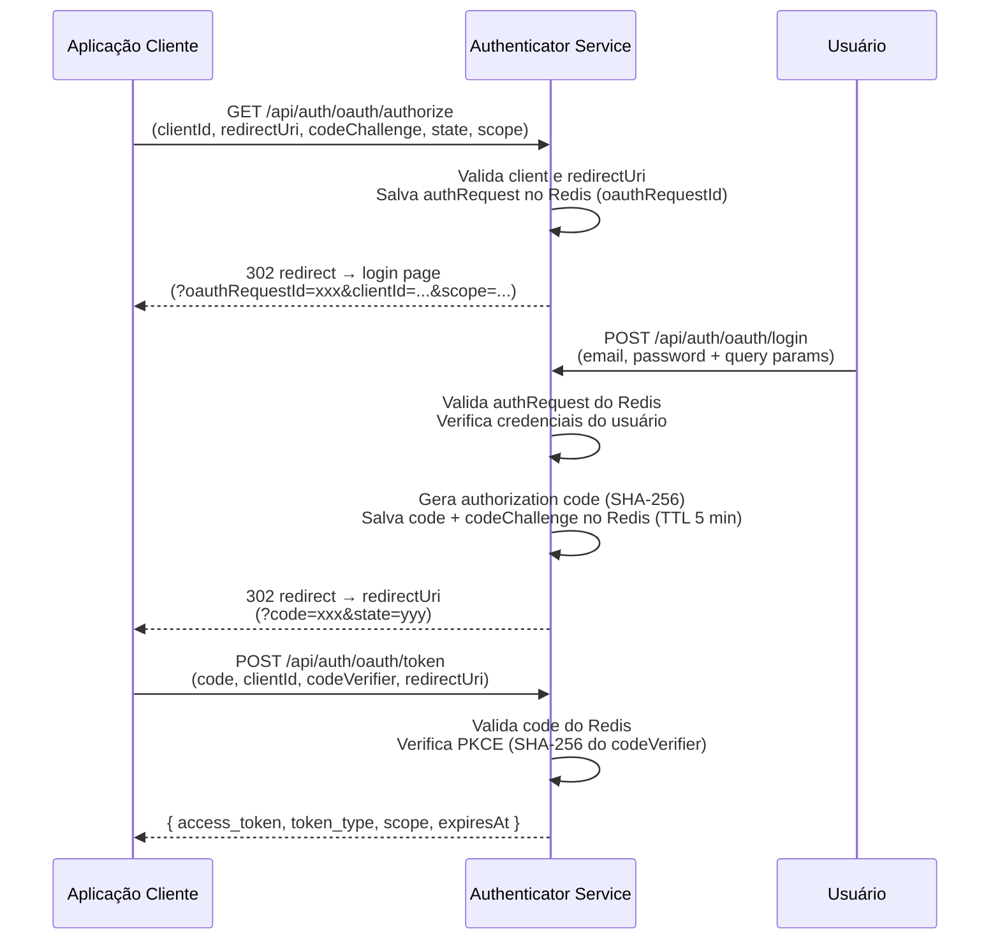
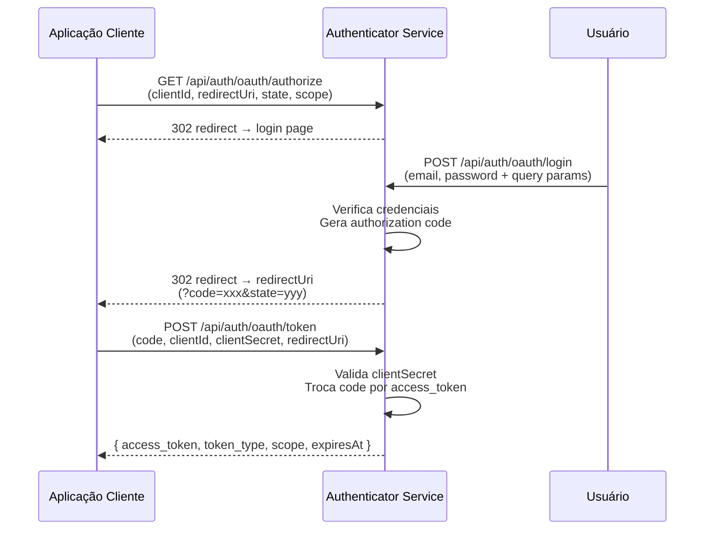
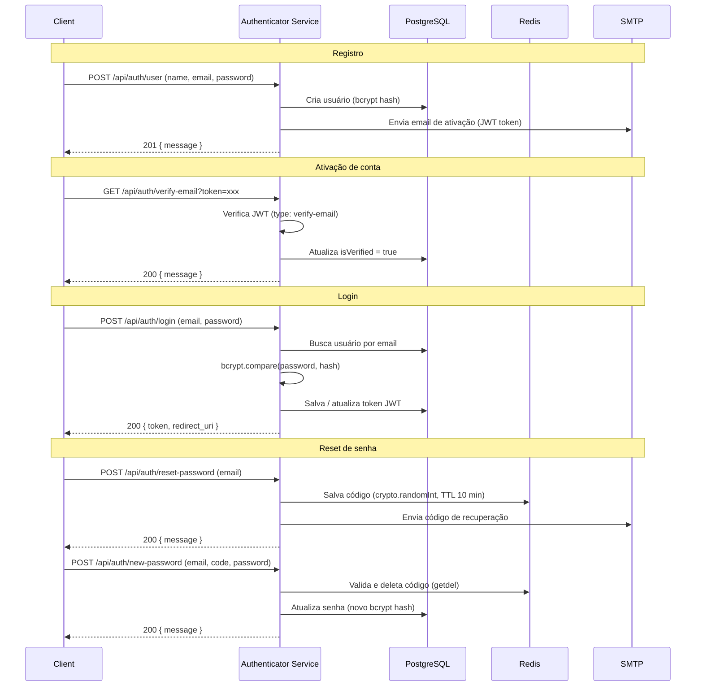

# Authenticator Service

<p align="right">
  <a href="./README.md">🇺🇸 English</a>
</p>


Serviço de autenticação e autorização construído com **NestJS**, implementando login seguro, verificação de email, reset de senha e um fluxo **OAuth2 completo** com suporte a Authorization Code e PKCE.

---

## Sumário

- [Funcionalidades](#funcionalidades)
- [Tech Stack](#tech-stack)
- [Fluxo OAuth2](#fluxo-oauth2)
- [Fluxo de Autenticação](#fluxo-de-autenticação)
- [Endpoints](#endpoints)
- [Começando](#começando)
- [Variáveis de Ambiente](#variáveis-de-ambiente)
- [Testes](#testes)
- [Estrutura do Projeto](#estrutura-do-projeto)
- [CI/CD](#cicd)

---

## Funcionalidades

- **Autenticação de Usuários** — Login, registro e verificação de email com JWT
- **Gerenciamento de Senhas** — Reset e atualização via código enviado por email com `crypto.randomInt`
- **OAuth2** — Fluxo Authorization Code completo com suporte a PKCE (`S256`) para clientes públicos
- **Gerenciamento de Clientes** — Registro e gestão de aplicações OAuth2 (clientes confidenciais e públicos)
- **Notificações por Email** — Templates dinâmicos com Nodemailer + Handlebars para ativação de conta e reset
- **Rate Limiting** — Proteção contra brute-force nos endpoints sensíveis via `@nestjs/throttler`
- **Health Check** — Verificação de conectividade com PostgreSQL e Redis via `@nestjs/terminus`
- **Logging Estruturado** — Logger próprio com contexto por método, baseado no `ConsoleLogger` do NestJS
- **Documentação da API** — Swagger interativo em `/api/docs`

---

## Tech Stack

| Camada          | Tecnologia                   |
| --------------- | ---------------------------- |
| Framework       | NestJS 11                    |
| Linguagem       | TypeScript 5.9               |
| Banco de dados  | PostgreSQL (TypeORM)         |
| Cache / Sessões | Redis (ioredis)              |
| Autenticação    | JWT (`@nestjs/jwt`) + Bcrypt |
| Validação       | class-validator + Joi        |
| Email           | Nodemailer + Handlebars      |
| Documentação    | Swagger / OpenAPI            |
| Testes          | Jest 30                      |
| Package manager | pnpm 10                      |

---

## Fluxo OAuth2

### Authorization Code + PKCE (clientes públicos)



### Authorization Code (clientes confidenciais)



---

## Fluxo de Autenticação



---

## Endpoints

Todos os endpoints são prefixados com `/api/auth`.

### Autenticação — `/api/auth`

| Método | Rota                      | Descrição                          | Rate Limit |
| ------ | ------------------------- | ---------------------------------- | ---------- |
| `POST` | `/login`                  | Login do usuário                   | 4 req/min  |
| `GET`  | `/verify-email?token=`    | Ativa conta via token JWT          | —          |
| `POST` | `/reset-password`         | Solicita reset de senha por email  | 4 req/min  |
| `POST` | `/new-password`           | Define nova senha com código Redis | 4 req/min  |
| `POST` | `/new-token/email-active` | Reenvio do email de ativação       | 4 req/min  |

### Usuário — `/api/auth/user`

| Método | Rota | Descrição             |
| ------ | ---- | --------------------- |
| `POST` | `/`  | Registra novo usuário |

### OAuth2 — `/api/auth/oauth`

| Método | Rota         | Descrição                                                     | Rate Limit |
| ------ | ------------ | ------------------------------------------------------------- | ---------- |
| `GET`  | `/authorize` | Inicia fluxo OAuth2, retorna redirect com `oauthRequestId`    | —          |
| `POST` | `/login`     | Login OAuth2 — valida authRequest e gera `code`               | 5 req/min  |
| `POST` | `/token`     | Troca `code` por `access_token` (suporta PKCE e clientSecret) | 5 req/min  |

### Cliente — `/api/auth/client`

| Método | Rota | Descrição                      |
| ------ | ---- | ------------------------------ |
| `POST` | `/`  | Registra nova aplicação OAuth2 |

### Health — `/api/auth/health`

| Método | Rota | Descrição                             |
| ------ | ---- | ------------------------------------- |
| `GET`  | `/`  | Verifica status do PostgreSQL e Redis |

---

## Começando

### Pré-requisitos

- Node.js 22+
- Docker e Docker Compose
- pnpm 10+

### Instalação

```bash
# 1. Clone o repositório
git clone https://github.com/LuisFernando12/Authenticator-back.git
cd Authenticator-back

# 2. Instale as dependências
pnpm install

# 3. Configure as variáveis de ambiente
cp .env.template .env
# edite o .env com seus valores
```

### Executando

**Modo desenvolvimento** (sobe Postgres + Redis via Docker, app em watch mode):

```bash
pnpm start:dev
```

**Somente infraestrutura** (Postgres + Redis):

```bash
pnpm start:docker
```

**Modo produção:**

```bash
pnpm build
pnpm start:prod
```

**Ambiente completo com Docker Compose:**

```bash
docker compose up
```

API disponível em `http://localhost:3000`.
Documentação Swagger: `http://localhost:3000/api/docs`.

---

## Variáveis de Ambiente

Copie `.env.template` para `.env` e preencha os valores:

```env
# PostgreSQL
USER_DB=
DB_PASSWORD=
DB_NAME=
DB_PORT=5432

# URLs do serviço
SERVICE_VERIFY_EMAIL_URL=   # URL base para links de verificação de email
SERVICE_URL=                # URL pública do serviço
SERVICE_RESET_PASSWORD_URL= # URL da página de reset de senha
REDIRECT_URI=               # URI de redirecionamento padrão pós-login

# CORS
CORS_ORIGIN=                # Origem permitida (ex: http://localhost:4000)

# OAuth2
OAUTH_LOGIN_URL=            # URL da página de login OAuth2 do frontend

# Redis
REDIS_URI=                  # URI completa (ex: redis://:senha@localhost:6379)

# SMTP
SMTP_PORT=
SERVER_SMTP=                # Servidor SMTP hostname (ex: smtp.example.com)
SERVER_SMTP_USER_NAME=
SERVER_SMTP_PASSWORD=

# JWT
SECRET=                     # Chave secreta para assinar tokens JWT
```

---

## Testes

```bash
# Unitários
pnpm test

# Com cobertura
pnpm test:cov

# Watch mode
pnpm test:watch

# E2E
pnpm test:e2e
```

Os testes unitários cobrem todos os services com mocks isolados. O padrão adotado é `expect(fn()).rejects.toThrow()` para cenários de erro, garantindo que os casos sejam realmente exercitados.

---

## Estrutura do Projeto

```
src/
├── config/
│   ├── errors/
│   │   └── oauth.error.ts          # Erros OAuth2 tipados (RFC 6749)
│   └── logger/
│       ├── auth-logger.config.ts   # Logger com métodos log/error/warn/debug
│       └── base-logger.ts          # Extends ConsoleLogger do NestJS
├── controller/                     # Camada HTTP
│   ├── auth.controller.ts
│   ├── client.controller.ts
│   ├── health.controller.ts
│   ├── oauth.controller.ts
│   └── user.controller.ts
├── dto/                            # Data Transfer Objects (validação)
├── entity/                         # Entidades TypeORM
│   ├── client.entity.ts
│   ├── token.entity.ts
│   ├── user-client-consent.entity.ts
│   └── user.entity.ts
├── module/                         # Módulos NestJS
├── repository/                     # Camada de acesso a dados
├── service/                        # Lógica de negócio
│   ├── auth.service.ts
│   ├── client.service.ts
│   ├── email.service.ts
│   ├── oauth.service.ts
│   ├── redis.service.ts
│   ├── token.service.ts
│   └── user.service.ts
└── templates/                      # Templates Handlebars para emails
    ├── activeAccount.hbs
    └── resetPassword.hbs

test/
└── unit/
    └── service/
        ├── mock/                   # Mocks reutilizáveis por service
        └── *.spec.ts               # Testes unitários por service
```

---

## CI/CD

O pipeline de integração contínua roda automaticamente em cada push e pull request para `main`:

1. **Checkout** do código
2. **Setup pnpm 10** + cache de dependências
3. **Setup Node.js 22**
4. **Install** — `pnpm install --frozen-lockfile`
5. **Build** — `pnpm build`
6. **Test** — `pnpm test`
7. **Coverage** — `pnpm test:cov`

---

## Licença

Este projeto está licenciado sob a [MIT License](./LICENSE).
