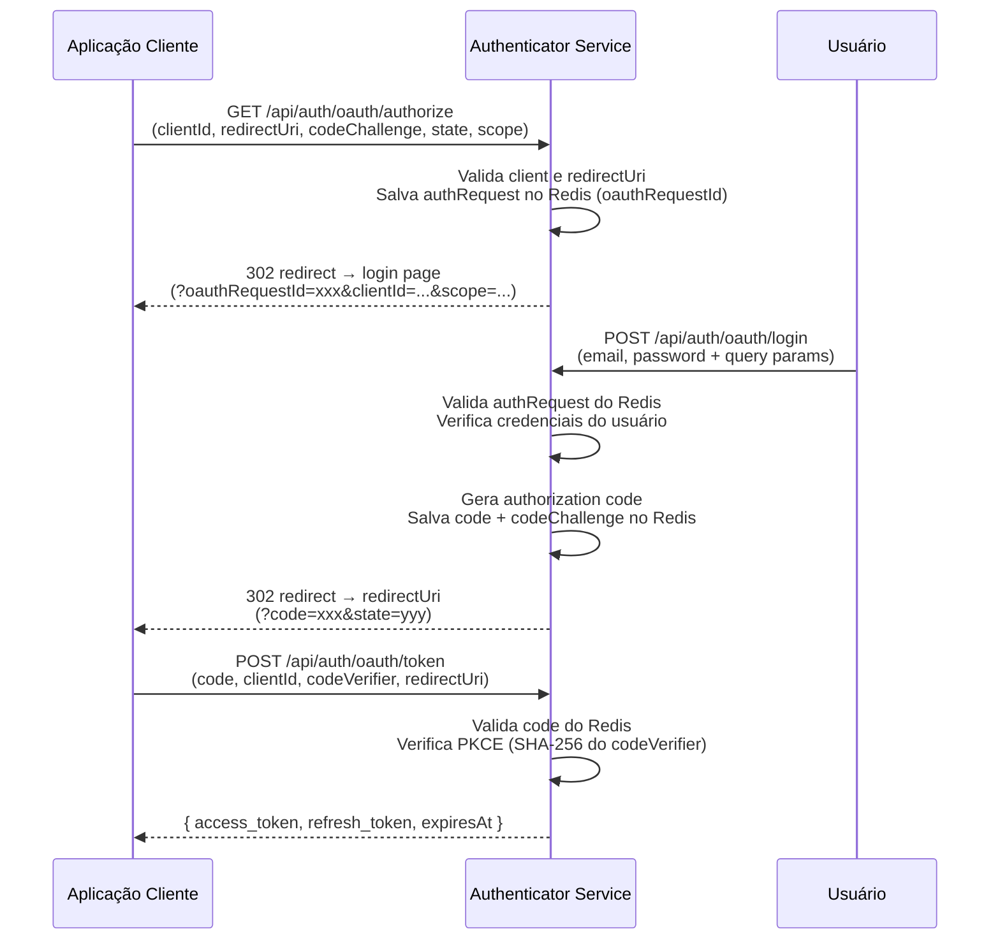
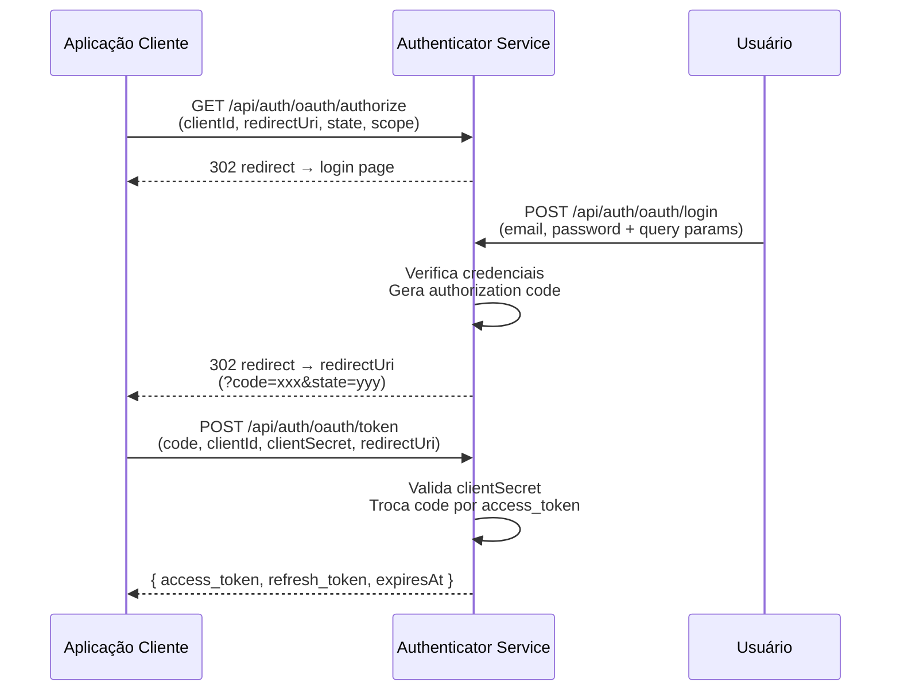
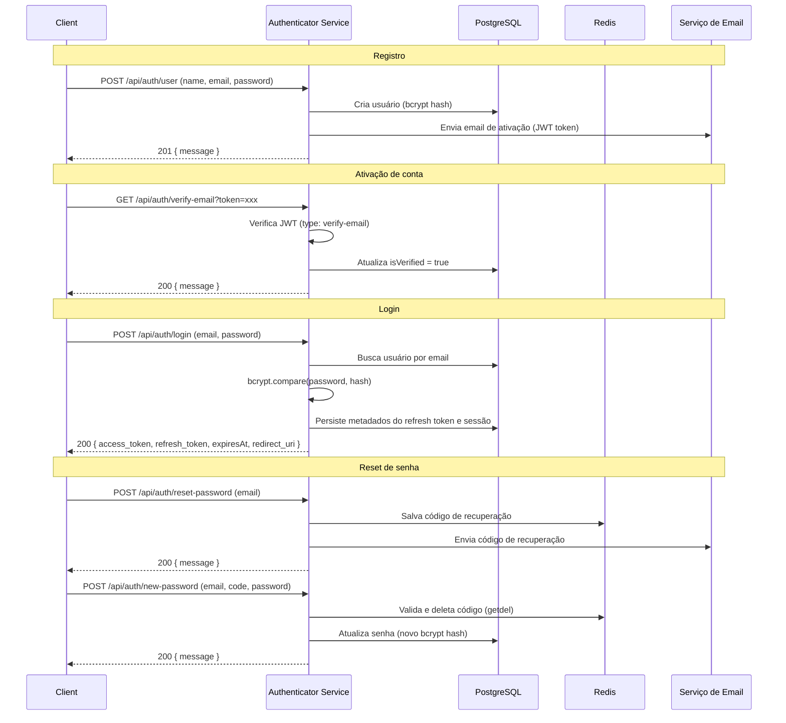

# Authenticator Service

<p align="right">
  <a href="./README.md">🇺🇸 English</a>
</p>


Serviço de autenticação e autorização construído com **NestJS**, implementando login seguro, verificação de email, reset de senha e um fluxo **OAuth2 completo** com suporte a Authorization Code e PKCE.

---

## Sumário

- [Funcionalidades](#funcionalidades)
- [Tech Stack](#tech-stack)
- [Fluxo OAuth2](#fluxo-oauth2)
- [Fluxo de Autenticação](#fluxo-de-autenticação)
- [Endpoints](#endpoints)
- [Começando](#começando)
- [Variáveis de Ambiente](#variáveis-de-ambiente)
- [Testes](#testes)
- [Estrutura do Projeto](#estrutura-do-projeto)
- [CI/CD](#cicd)

---

## Funcionalidades

- **Autenticação de Usuários** — Login, registro e verificação de email com JWT
- **Gerenciamento de Senhas** — Reset e atualização via código enviado por email com `crypto.randomInt`
- **OAuth2** — Fluxo Authorization Code completo com suporte a PKCE (`S256`) para clientes públicos
- **Gerenciamento de Clientes** — Registro e gestão de aplicações OAuth2 (clientes confidenciais e públicos)
- **Notificações por Email** — Templates dinâmicos com Gmail API, Nodemailer e Handlebars para ativação de conta, bloqueio/desbloqueio e reset de senha
- **Rate Limiting** — Proteção contra brute-force nos endpoints sensíveis via `@nestjs/throttler`
- **Health Check** — Verificação de conectividade com PostgreSQL e Redis via `@nestjs/terminus`
- **Logging Estruturado** — Logger próprio com contexto por método, baseado no `ConsoleLogger` do NestJS
- **Documentação da API** — Swagger interativo em `/api/docs`

---

## Tech Stack

| Camada          | Tecnologia                   |
| --------------- | ---------------------------- |
| Framework       | NestJS 11                    |
| Linguagem       | TypeScript 5.9               |
| Banco de dados  | PostgreSQL (TypeORM)         |
| Cache / Sessões | Redis (ioredis)              |
| Autenticação    | JWT (`@nestjs/jwt`) + Bcrypt |
| Validação       | class-validator + Joi        |
| Email           | Nodemailer + Handlebars      |
| Documentação    | Swagger / OpenAPI            |
| Testes          | Jest 30                      |
| Package manager | pnpm 10                      |

---

## Fluxo OAuth2

### Authorization Code + PKCE (clientes públicos)


```mermaid
sequenceDiagram
    participant App as Aplicação Cliente
    participant Auth as Authenticator Service
    participant User as Usuário

    App->>Auth: GET /api/auth/oauth/authorize<br/>(clientId, redirectUri, codeChallenge, state, scope)
    Auth->>Auth: Valida client e redirectUri<br/>Salva authRequest no Redis (oauthRequestId)
    Auth-->>App: 302 redirect → login page<br/>(?oauthRequestId=xxx&clientId=...&scope=...)

    User->>Auth: POST /api/auth/oauth/login<br/>(email, password + query params)
    Auth->>Auth: Valida authRequest do Redis<br/>Verifica credenciais do usuário
    Auth->>Auth: Gera authorization code<br/>Salva code + codeChallenge no Redis
    Auth-->>App: 302 redirect → redirectUri<br/>(?code=xxx&state=yyy)

    App->>Auth: POST /api/auth/oauth/token<br/>(code, clientId, codeVerifier, redirectUri)
    Auth->>Auth: Valida code do Redis<br/>Verifica PKCE (SHA-256 do codeVerifier)
    Auth-->>App: { access_token, refresh_token, expiresAt }
```

### Authorization Code (clientes confidenciais)


```mermaid
sequenceDiagram
    participant App as Aplicação Cliente
    participant Auth as Authenticator Service
    participant User as Usuário

    App->>Auth: GET /api/auth/oauth/authorize<br/>(clientId, redirectUri, state, scope)
    Auth-->>App: 302 redirect → login page

    User->>Auth: POST /api/auth/oauth/login<br/>(email, password + query params)
    Auth->>Auth: Verifica credenciais<br/>Gera authorization code
    Auth-->>App: 302 redirect → redirectUri<br/>(?code=xxx&state=yyy)

    App->>Auth: POST /api/auth/oauth/token<br/>(code, clientId, clientSecret, redirectUri)
    Auth->>Auth: Valida clientSecret<br/>Troca code por access_token
    Auth-->>App: { access_token, refresh_token, expiresAt }
```

---

## Fluxo de Autenticação


```mermaid
sequenceDiagram
    participant Client
    participant Auth as Authenticator Service
    participant DB as PostgreSQL
    participant Redis
    participant Email as Serviço de Email

    Note over Client,Email: Registro
    Client->>Auth: POST /api/auth/user (name, email, password)
    Auth->>DB: Cria usuário (bcrypt hash)
    Auth->>Email: Envia email de ativação (JWT token)
    Auth-->>Client: 201 { message }

    Note over Client,Email: Ativação de conta
    Client->>Auth: GET /api/auth/verify-email?token=xxx
    Auth->>Auth: Verifica JWT (type: verify-email)
    Auth->>DB: Atualiza isVerified = true
    Auth-->>Client: 200 { message }

    Note over Client,Email: Login
    Client->>Auth: POST /api/auth/login (email, password)
    Auth->>DB: Busca usuário por email
    Auth->>Auth: bcrypt.compare(password, hash)
    Auth->>DB: Persiste metadados do refresh token e sessão
    Auth-->>Client: 200 { access_token, refresh_token, expiresAt, redirect_uri }

    Note over Client,Email: Reset de senha
    Client->>Auth: POST /api/auth/reset-password (email)
    Auth->>Redis: Salva código de recuperação
    Auth->>Email: Envia código de recuperação
    Auth-->>Client: 200 { message }

    Client->>Auth: POST /api/auth/new-password (email, code, password)
    Auth->>Redis: Valida e deleta código (getdel)
    Auth->>DB: Atualiza senha (novo bcrypt hash)
    Auth-->>Client: 200 { message }
```

---

## Endpoints

Todos os endpoints são prefixados com `/api/auth`.

### Autenticação — `/api/auth`

| Método | Rota                      | Descrição                          | Rate Limit |
| ------ | ------------------------- | ---------------------------------- | ---------- |
| `POST` | `/login`                  | Login do usuário                   | 5 req/min  |
| `GET`  | `/verify-email?token=`    | Ativa conta via token JWT          | 5 req/min  |
| `POST` | `/reset-password`         | Solicita reset de senha por email  | 5 req/min  |
| `POST` | `/new-password`           | Define nova senha com código Redis | 5 req/min  |
| `POST` | `/new-token/email-active` | Reenvio do email de ativação       | 5 req/min  |
| `POST` | `/unblock-account`        | Desbloqueia uma conta usando código | 5 req/min  |

### Usuário — `/api/auth/user`

| Método | Rota | Descrição             |
| ------ | ---- | --------------------- |
| `POST` | `/`  | Registra novo usuário |

### OAuth2 — `/api/auth/oauth`

| Método | Rota                | Descrição                                                                                                    | Rate Limit |
| ------ | ------------------- | ------------------------------------------------------------------------------------------------------------ | ---------- |
| `GET`  | `/authorize`        | Inicia fluxo OAuth2, retorna redirect com `oauthRequestId`                                                   | —          |
| `POST` | `/login`            | Login OAuth2 — valida authRequest e gera `code`                                                              | 5 req/min  |
| `POST` | `/token`            | Troca `code` por `access_token` (suporta PKCE e clientSecret)                                                | 5 req/min  |
| `POST` | `/refresh-token`    | Atualiza `access_token` e `refresh_token` usando `grantType` e `refreshToken` no payload                     | 5 req/min  |
| `POST` | `/revoke-token`     | Revoga um access ou refresh token enviado no campo `token` do payload                                        | 5 req/min  |
| `POST` | `/token-introspect` | Introspecta um access ou refresh token enviado no campo `token` do payload                                   | 5 req/min  |

### Cliente — `/api/auth/client`

| Método | Rota             | Descrição                         |
| ------ | ---------------- | --------------------------------- |
| `POST` | `/`              | Registra nova aplicação OAuth2    |
| `GET`  | `/client-id/:id` | Busca um client OAuth2 por clientId |

### Health — `/api/auth/health`

| Método | Rota | Descrição                             |
| ------ | ---- | ------------------------------------- |
| `GET`  | `/`  | Verifica status do PostgreSQL e Redis |

---

## Começando

### Pré-requisitos

- Node.js 22+
- Docker e Docker Compose
- pnpm 10+

### Instalação

```bash
# 1. Clone o repositório
git clone https://github.com/LuisFernando12/Authenticator-back.git
cd Authenticator-back

# 2. Instale as dependências
pnpm install

# 3. Configure as variáveis de ambiente
cp .env.template .env
# edite o .env com seus valores
```

### Executando

**Modo desenvolvimento** (sobe Postgres + Redis via Docker, app em watch mode):

```bash
pnpm start:dev
```

**Somente infraestrutura** (Postgres + Redis):

```bash
pnpm start:docker
```

**Modo produção:**

```bash
pnpm build
pnpm start:prod
```

**Ambiente completo com Docker Compose:**

```bash
docker compose up
```

API disponível em `http://localhost:3000`.
Documentação Swagger: `http://localhost:3000/api/docs`.

---

## Variáveis de Ambiente

Copie `.env.template` para `.env` e preencha os valores:

```env
# PostgreSQL
DB_HOST=
DB_USER=
DB_PASSWORD=
DB_NAME=
DB_PORT=5432

# URLs do serviço
SERVICE_VERIFY_EMAIL_URL=   # URL base para links de verificação de email
SERVICE_URL=                # URL pública do serviço
SERVICE_RESET_PASSWORD_URL= # URL da página de reset de senha
SERVICE_UNBLOCK_ACCOUNT_URL= # URL da página de desbloqueio de conta
REDIRECT_URI=               # URI de redirecionamento padrão pós-login

# CORS
CORS_ORIGIN=                # Origem permitida (ex: http://localhost:4000)
TRUST_PROXY=0               # Configuração opcional de trust proxy do Express

# OAuth2
OAUTH_LOGIN_URL=            # URL da página de login OAuth2 do frontend

# Redis
REDIS_URI=                  # URI completa (ex: redis://:senha@localhost:6379)

# Gmail API
GMAIL_CLIENT_ID=
GMAIL_CLIENT_SECRET=
GMAIL_REDIRECT_URI=
GMAIL_REFRESH_TOKEN=
GMAIL_SENDER_EMAIL=

# JWT
SECRET=                     # Chave secreta para assinar tokens JWT
CLIENT_SECRET_PEPPER=       # Pepper usado ao gerar hash de client secrets OAuth2
ACCESS_TOKEN_EXPIRES_IN=15min
REFRESH_TOKEN_EXPIRES_DAYS=15
EMAIL_VERIFICATION_TOKEN_EXPIRES=6h

# Runtime
NODE_ENV=
PORT=3000
```

---

## Testes

```bash
# Unitários
pnpm test

# Com cobertura
pnpm test:cov

# Watch mode
pnpm test:watch

# E2E
pnpm test:e2e
```

Os testes unitários cobrem os principais use cases com fakes isolados. O padrão adotado é `expect(fn()).rejects.toThrow()` para cenários de erro, garantindo que os casos sejam realmente exercitados.

---

## Estrutura do Projeto

```
src/
├── auth/                           # Domínio de autenticação
│   ├── application/
│   │   ├── port/                   # Contratos da aplicação
│   │   └── use-case/               # Fluxos de login, ativação e senha
│   ├── domain/
│   │   ├── entity/
│   │   ├── enum/
│   │   ├── error/
│   │   └── value-object/
│   └── infrastructure/
│       ├── adapter/
│       ├── controller/
│       ├── dto/
│       └── module/
├── client/                         # Gestão de clients OAuth2
│   ├── application/
│   ├── domain/
│   └── infrastructure/
│       ├── adapter/
│       ├── controller/
│       ├── dto/
│       ├── module/
│       ├── persistence/
│       └── repository/
├── config/
│   ├── database/                   # Data source TypeORM e migrations
│   ├── decorator/                  # Decorators customizados de request
│   ├── filters/                    # Filtros globais de exceção
│   └── logger/
├── consent/                        # Domínio de consentimento OAuth2
│   ├── application/
│   │   ├── port/
│   │   ├── service/
│   │   └── use-case/
│   ├── domain/
│   └── infrastructure/
├── core/                           # Serviços e módulos compartilhados
│   ├── application/
│   ├── domain/
│   └── infrastructure/
├── email/                          # Fila, workers, providers e templates de email
│   ├── application/
│   ├── domain/
│   └── infrastructure/
├── module/
│   └── app.module.ts               # Módulo raiz NestJS
├── oauth/                          # Fluxo de authorization server OAuth2
│   ├── application/
│   │   ├── port/
│   │   └── use-case/
│   ├── domain/
│   │   ├── entity/
│   │   ├── error/
│   │   └── value-object/
│   └── infrastructure/
│       ├── adapter/
│       ├── controller/
│       ├── dto/
│       └── module/
├── security-event/                 # Pipeline de logs de eventos de segurança
│   ├── application/
│   ├── domain/
│   └── infrastructure/
├── session/                        # Persistência de sessões por família de tokens
│   ├── domain/
│   └── infrastructure/
├── token/                          # Geração, refresh, revogação e introspecção de tokens
│   ├── application/
│   │   ├── interface/
│   │   ├── port/
│   │   ├── service/
│   │   ├── type/
│   │   └── use-case/
│   ├── domain/
│   └── infrastructure/
│       ├── adapter/
│       ├── module/
│       ├── persistence/
│       └── repository/
└── user/                           # Registro e busca de usuários
    ├── application/
    │   ├── port/
    │   └── use-case/
    ├── domain/
    └── infrastructure/
        ├── adapter/
        ├── controller/
        ├── dto/
        ├── module/
        ├── persistence/
        └── repository/

test/
├── e2e/
│   └── setup/
└── unit/
    └── use-case/
        ├── auth/
        ├── consent/
        ├── oauth/
        ├── token/
        └── user/
```

---

## CI/CD

O pipeline de integração contínua roda automaticamente em cada push e pull request para `main` e `develop`:

1. **Checkout** do código
2. **Setup pnpm 10** + cache de dependências
3. **Setup Node.js 22**
4. **Install** — `pnpm install --frozen-lockfile`
5. **Build** — `pnpm build`
6. **Test** — `pnpm test`
7. **Coverage** — `pnpm test:cov`
8. **E2E** — `pnpm test:e2e`
9. **Release** — `npx semantic-release`

---

## Licença

Este projeto está licenciado sob a [MIT License](./LICENSE).
